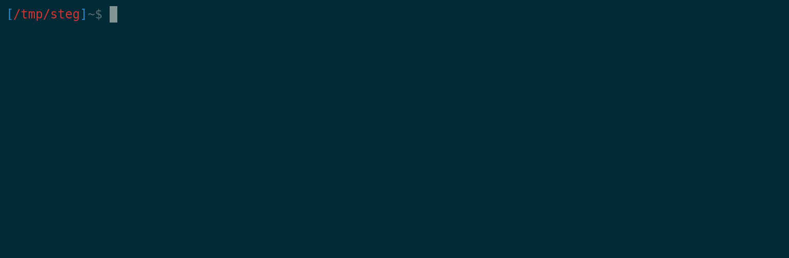
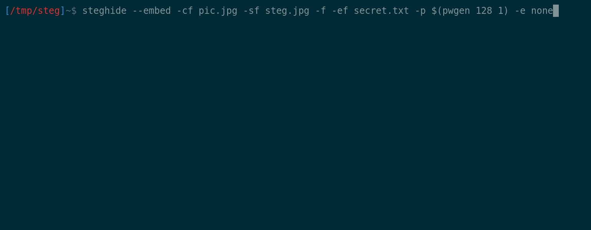

# :zap: Stegseek

Stegseek is a lightning fast steghide cracker that can be used to extract hidden data from files. It is built as a fork of the original steghide project and, as a result, it is _thousands of times_ faster than other crackers and can run through the entirety of **`rockyou.txt`\* in under 2 seconds.**  
  
Stegseek can also be used to extract steghide metadata without a password, which can be used to test whether a file contains steghide data.
  
>\* `rockyou.txt` is a well-known password list with over 14 million passwords.

## Demo: random rockyou.txt password (in real time)



Skip ahead to [Performance](#chart_with_upwards_trend-performance) for some raw numbers.

# :wrench: Installation

The following instructions walk you through the installation process. Alternatively, you can run Stegseek in a Docker container. Skip ahead to [Docker](#whale-docker) for instructions.

## Releases

### Linux

On recent Ubuntu and other Debian-based systems, you can use the provided `.deb` package for installation:

1. Download the latest [Stegseek release](https://github.com/RickdeJager/stegseek/releases)
1. Install the `.deb` file using `sudo apt install ./stegseek_0.6-1.deb`  
  
On other systems you will have to build Stegseek yourself. See [BUILD.md](BUILD.md) for more information.  

### Windows

Building Stegseek as a native Windows app is sadly not supported. Instead you should run Stegseek using [WSL](https://docs.microsoft.com/en-us/windows/wsl/about). The Ubuntu WSL distribution is recommended for optimal compatibility.  
Once you have configured WSL, Stegseek can be installed using the above Linux instructions.  

By default, WSL mounts the `C:\` drive at `/mnt/c/`, which you can use to easily access your files.


# :arrow_forward: Using Stegseek

## Cracking
The most important feature of stegseek is wordlist cracking:
```
stegseek [stegofile.jpg] [wordlist.txt]
```

This mode will simply try all passwords in the provided wordlist against the provided stegofile.

## Detection and passwordless extraction (CVE-2021-27211)
Stegseek can also be used to detect and extract any **unencrypted** (meta) data from a steghide image. This exploits the fact that the random number generator used in steghide only has 2^32 possible seeds, which can be bruteforced in a matter of minutes.  

```
stegseek --seed [stegofile.jpg]
```  
This command will tell you:
* Whether this file actually contains steghide content.
* How much hidden content the file contains.
* How the content was encrypted  .
  
If you're (very) lucky and the file was encoded without encryption, this mode will even recover the encoded file for you!  
  
The below demo features [a challenge from X-MAS CTF 2020](https://ctftime.org/writeup/25391). A flag was hidden using a secure random password, but without encryption enabled.
Within a few minutes, Stegseek is able to recover the embedded file without needing to guess the correct password.



## Available arguments

Use `stegseek --help` to get the full list of available options:
```
=== StegSeek Help ===
To crack a stegofile:
stegseek [stegofile.jpg] [wordlist.txt]

Commands:
 --crack                 Crack a stego file using a wordlist. This is the default mode.
 --seed                  Crack a stego file by attempting all embedding patterns.
                         This mode can be used to detect a file encoded by steghide.
                         In case the file was encoded without encryption, this mode will
                         even recover the embedded file.
Positional arguments:
 --crack [stegofile.jpg] [wordlist.txt] [output.txt]
 --seed  [stegofile.jpg] [output.txt]

Keyword arguments:
 -sf, --stegofile        select stego file
 -wl, --wordlist         select the wordlist file
 -xf, --extractfile      select file name for extracted data
 -t, --threads           set the number of threads. Defaults to the number of cores.
 -f, --force             overwrite existing files
 -v, --verbose           display detailed information
 -q, --quiet             hide performance metrics (can improve performance)
 -s, --skipdefault       don't add guesses to the wordlist (empty password, filename, ...)
 -n, --nocolor           disable colors in output
 -c, --continue          continue cracking after a result has been found.
                         (A stego file might contain multiple embedded files)
 -a, --accessible        simplify the output to be more screen reader friendly

Use "stegseek --help -v" to include steghide's help.
```

## Steghide
Stegseek includes nearly all of steghide's functionality, so it can also be used to embed or extract data as normal. The only catch is that commands must use the `--command` format.  
For example, `steghide embed [...]` becomes `stegseek --embed [...]` .  

### Positional arguments
* `stegseek --embed <data> <coverfile> [<stegofile>]`
* `stegseek --extract <stegofile> [<output>]`

# :whale: Docker
You can also run Stegseek as Docker container:

```
docker run --rm -it -v "$(pwd):/steg" rickdejager/stegseek [stegofile.jpg] [wordlist.txt]
```

This does require that the wordlist and stegofile are located in current working directory, as that folder is mounted to `/steg` inside of the container.

# :chart_with_upwards_trend: Performance
This is where Stegseek really shines. As promised, let's start with the "`rockyou.txt` in just 2 seconds" claim.  
All of these numbers are measured on a laptop with an Intel i7-7700HQ CPU @ 2.80GHz and 8 GB of RAM.  

## RockYou.txt
I picked the last password in `rockyou.txt` without control characters: "␣␣␣␣␣␣␣1" (7 spaces followed by '1').  
This password is on line `14344383` out of `14344391`  

```
> StegSeek 0.6 - https://github.com/RickdeJager/StegSeek

[i] Found passphrase: "       1"          
[i] Original filename: "secret.txt".
[i] Extracting to "7spaces1.jpg.out".


real	0m1,211s
user	0m9,488s
sys	0m0,084s
```

And there it is, over 14 million passwords in less than 2 seconds :heart_eyes:.

## How does this compare to other tools?

To test the performance of of other tools, I created several stego files with different passwords, taken from `rockyou.txt`. I ran each of the tools with their default settings, except Stegbrute where I increased threading for a fair comparison.

| password    | Line        | Stegseek v0.6  | Stegcracker 2.0.9 | Stegbrute v0.1.1 (-t 8) |
|-------------|-------------|----------------|-------------------|-------------------------|
| "cassandra" | 1 000       |          0.05s |              3.1s |                    0.7s |
| "kupal"     | 10 000      |          0.05s |             14.4s |                    7.1s |
| "sagar"     | 100 000     |          0.09s |           2m23.0s |                 1m21.9s |
| "budakid1"  | 1 000 000   |          0.73s | [p]      23m50.0s |                13m45.7s |
| "␣␣␣␣␣␣␣1"  | 14 344 383  |          1.21s | [p]    5h41m52.5s | [p]          3h17m38.0s |

[p] = projected time based on previous results.  
  
  
----
  

To compare the speed of each tool, let's look at the last row of the table (otherwise Stegseek finishes before all threads have started).  

At this scale Stegseek is over **12 000** times faster than Stegcracker and over **7000** times faster than Stegbrute.

# :notebook: Changelog

## v0.6
2021-04-18  
improvements:  
* Fixed BMP cracking for files with a large palette.
* Added a `--continue` flag to search for multiple hidden files.
* Added an `--accessible` flag to make the CLI more screen reader friendly
* Made the CLI more consistent, added colors.
* `--crack` and `--seed` now throw proper exit codes for easier scripting.
* Lower performance overhead for metrics.
* fixed compiler flags for default build. 

## v0.5
2020-12-28  
improvements:  
* Uses way less memory (memory usage is no longer tied to Wordlist length)
* Wordlist is loaded on the fly, so we can start cracking immediately.
* Fixed high false positive rate on `--seed`  
  
## v0.4
2020-12-01  
improvements:  
* Added seed cracking to allow for passwordless data extraction
* Overhauled parser to allow for positional arguments
* cracks `rockyou.txt` in 2 seconds
### v0.4.1
2020-12-23  
Fixed a bug where stegseek would fail to find a password on rare occasions.

## v0.3
2020-11-08  
improvements:  
* Made threading lock-free s.t. multiple threads are used more efficiently
* Added `-xf` argument to `--crack`, used to specify the location of the extracted file
* Made the .deb package compatible with Debian/Kali
* cracks `rockyou.txt` in 4 seconds

## v0.2
2020-11-05  
improvements:  
* Give up on a passphrase once a single bit of the magic fails to decode
* Removed costly BitString / EmbData allocations
* Improved performance of the selector
* cracks `rockyou.txt` in 5 seconds.

## v0.1
2020-11-04  
Initial release, features:  
* Only loads the stego file once, unlike conventional crackers
* Workpool based threading
* Attempts to crack the first 3 bytes first, before attempting full decryption
* Added .deb package and docker container
* cracks `rockyou.txt` in 41 seconds.
